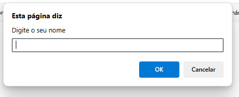
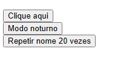
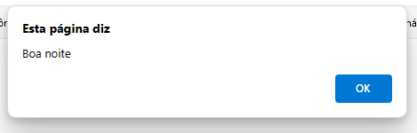
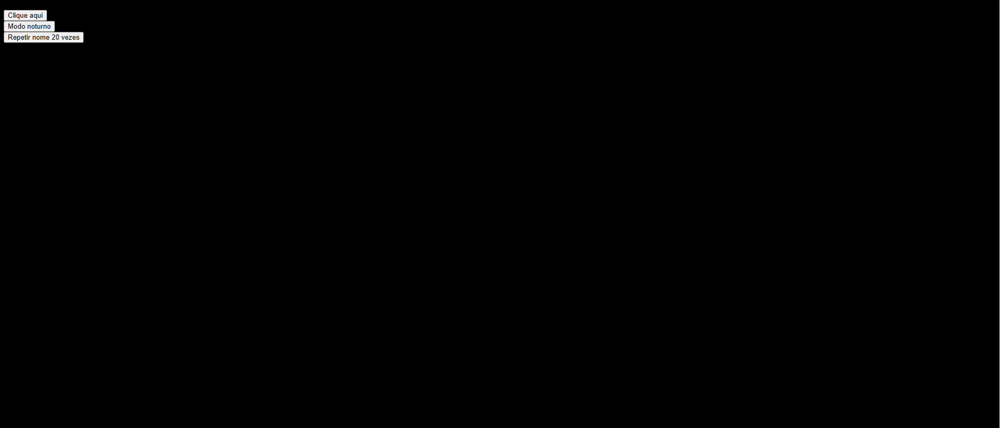
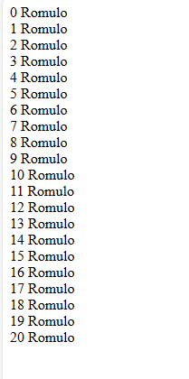

# aula-JS-FUNCTIONScomButtons
só umas funções em javascript com buttons pra treinar eventos como onclick. bem simples.
  

  <h3>Primeiro, a página pede o seu nome.</h3>
  

  

  <h3>Os botões da página.</h3>
  

  

  <h3>O primeiro botão dá esse alert.</h3>
  

  

  <h3>O segundo botão pinta a página de preto.</h3>
  

  

  <h3>O último botão repete o seu nome dado lá no começo 20 vezes.</h3>
  

